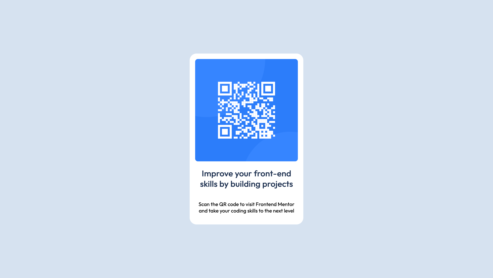

# Frontend Mentor - QR code component solution

This is a solution to the [QR code component challenge on Frontend Mentor](https://www.frontendmentor.io/challenges/qr-code-component-iux_sIO_H). Frontend Mentor challenges help you improve your coding skills by building realistic projects.
## Overview
A simple exercise to create a centered box containing a QR code and some text
## Built with
- Semantic HTML5 markup
- SCSS
- Flexbox
- CSS Grid
- Mobile-first workflow
## Author
- Website - [lluz.dev](https://lluz.dev)
- Frontend Mentor - [@lcalazansl](https://www.frontendmentor.io/profile/lcalazansl)
## Screenshot

